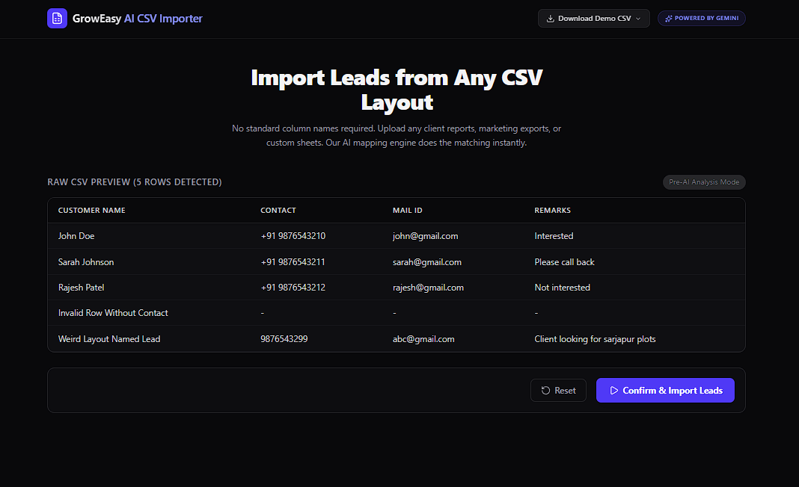
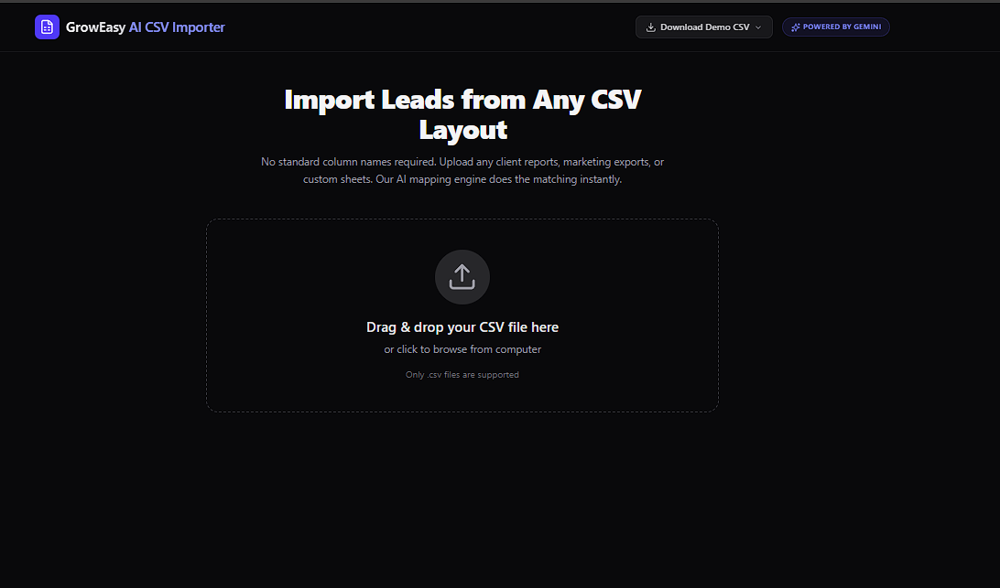
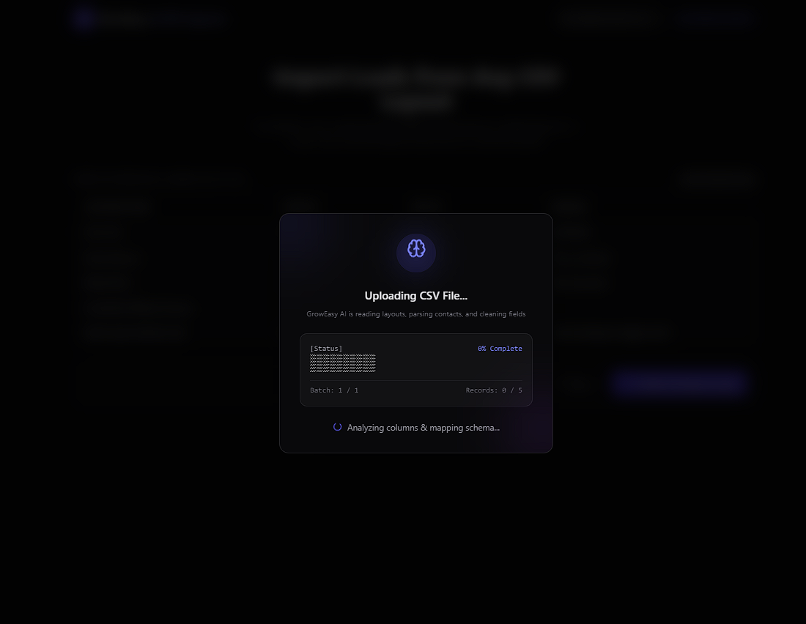
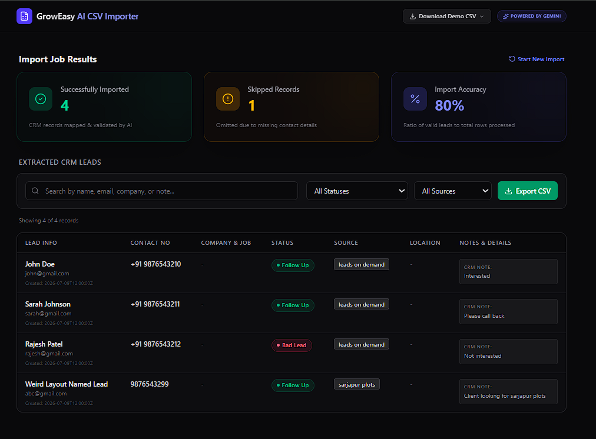
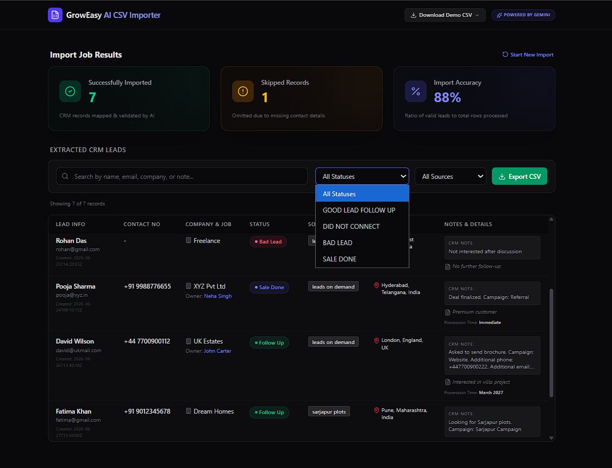
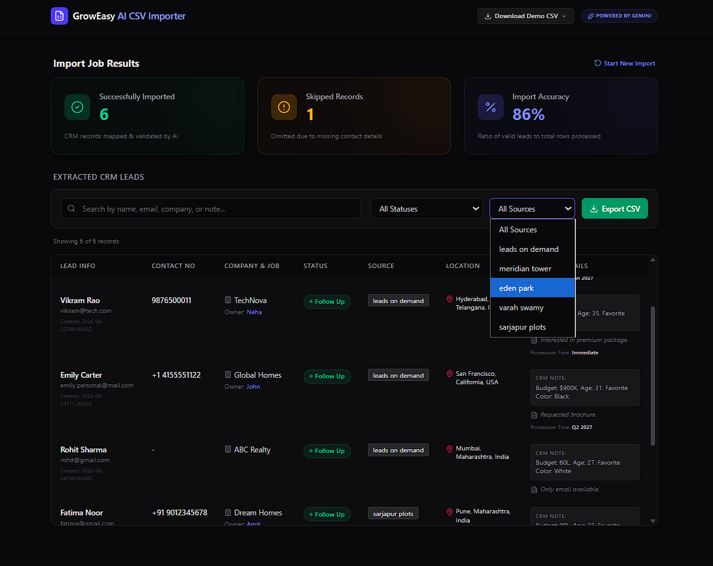
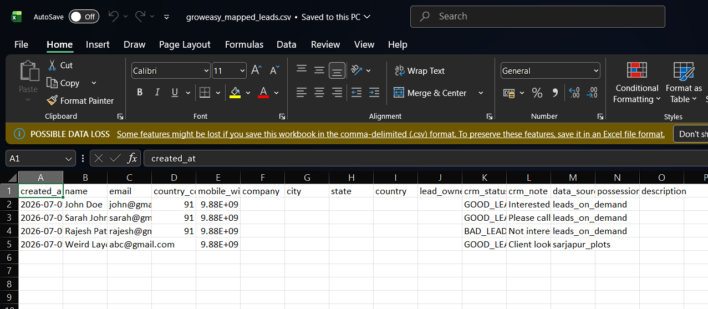

# 🚀 AI-Powered CRM CSV Lead Importer

An AI-powered web application that intelligently converts lead data from **any CSV format** into the standard **GrowEasy CRM** format.

## 🌐 Live Demo

**Frontend:** https://csv-lead-generator.vercel.app



Instead of relying on fixed column names, the application uses **Google Gemini 2.5 Flash** to understand the uploaded CSV and automatically map fields such as **Name, Email, Phone, Company, City, Notes, Lead Owner, Status**, and more.

---

## ✨ Features

- 📂 Upload any valid CSV file
- 👀 Preview uploaded data before importing
- 🤖 AI-powered field mapping using Gemini AI
- 📊 Import summary (Imported, Skipped & Accuracy)
- 🔍 Search and filter imported leads
- 📥 Export standardized CRM CSV
- 🌙 Modern Dark UI
- 📱 Fully Responsive
- ⚡ Batch processing with retry mechanism

---

## 🛠️ Tech Stack

### Frontend
- Next.js
- TypeScript
- Tailwind CSS
- Papa Parse
- TanStack Table

### Backend
- Node.js
- Express.js
- TypeScript
- Multer
- Zod

### AI
- Google Gemini 2.5 Flash

---

# 📁 Project Structure

```
csv_lead_generator/

│
├── frontend/
├── backend/
├── test_csv/
└── README.md
```

---

# ⚙️ Installation

## 1️⃣ Clone the Repository

```bash
git clone <your-repository-url>

cd csv_lead_generator
```

---

## 2️⃣ Backend Setup

```bash
cd backend

npm install
```

Create a `.env` file

```env
PORT=5000
GEMINI_API_KEY=YOUR_GEMINI_API_KEY
```

Run the backend

```bash
npm run dev
```

---

## 3️⃣ Frontend Setup

Open another terminal

```bash
cd frontend

npm install

npm run dev
```

Open

```
http://localhost:3000
```

---

# 📌 How It Works

1. Upload any CSV file.
2. Preview the uploaded data.
3. Click **Confirm & Import**.
4. Backend processes the CSV.
5. Gemini AI maps all fields to the GrowEasy CRM format.
6. View imported records.
7. Export the standardized CRM CSV.

---

# 📂 Sample CSV Files

The repository contains sample CSV files for testing.

- Standard Demo Leads
- Edge Case Leads
- Messy Leads Test

You can also upload your own CSV files.

---

# 📸 Demo

## 1. Upload CSV

Upload any valid CSV file using drag & drop or the file picker.



---

## 2. Preview Uploaded Data

Preview the uploaded CSV before importing. This allows users to verify the data before AI processing.


---

## 3. AI Processing

Once the user confirms the import, the backend processes the CSV in batches and Gemini AI intelligently maps the fields to the GrowEasy CRM format.



---

## 4. Import Summary

View the import statistics including successfully imported records, skipped records, and overall import accuracy.



---

## 5. Search & Filter Leads

Search imported leads and filter them by CRM status or data source.



---

## 6. AI Mapped CRM Leads

View the final AI-generated CRM records with standardized fields such as Name, Email, Phone, Company, Status, Source, and Notes.



---

## 7. Export Standardized CSV

Export all AI-mapped CRM records into a standardized CSV file ready for import into GrowEasy CRM.



---

# 🌐 Live Demo

### Frontend

```
https://csv-lead-generator.vercel.app/
```

### Backend

```
https://groweasy-backend-2u12.onrender.com
```

---

# 🔑 Environment Variables

Backend (`backend/.env`)

```env
PORT=5000
GEMINI_API_KEY=YOUR_GEMINI_API_KEY
```

---

# 👨‍💻 Author

**Mannan Shariff**

GitHub: https://github.com/MannanShariff

Portfolio: https://www.mannanshariff.me

LinkedIn: https://linkedin.com/in/mannan-shariff

---
